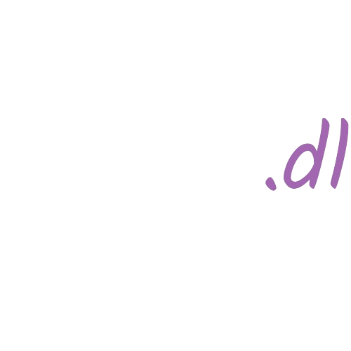

  

  <h3 align="center">3beats.dl - The best Youtube Video and Audio downloader</h3>

<!-- ABOUT THE PROJECT -->

## About The Project

[![Product Name Screen Shot][product-screenshot]](https://threebeats.onrender.com/)

### Built With

This section should list any major frameworks/libraries used to bootstrap your project. Leave any add-ons/plugins for the acknowledgements section. Here are a few examples.

- [![Next][Flask]][Next-url]

<!-- MARKDOWN LINKS & IMAGES -->

[product-screenshot]: static/img/product.png
[Flask]: https://img.shields.io/badge/with%20a%20logo-grey?style=for-the-badge&logo=flask
